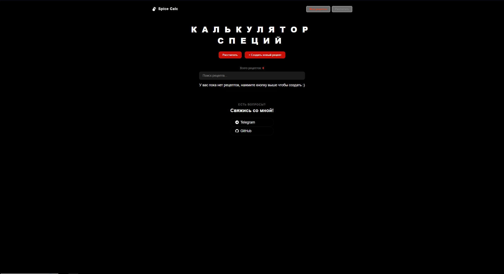

<div align="center">

# 🧂 Spice Calc (Ingredient Calculator)

  <p>
    <a href="https://aliveagain3228.github.io/Ingredient-Calculator/" target="_blank">
      
    </a>
  </p>

  <p>
    
    
    
    
    
  </p>

</div>

## 📝 About the Project

**Spice Calc** is a handy tool for chefs and culinary enthusiasts. The application allows users to create recipes with detailed ingredient lists and automatically calculates the required amount of spices for any given weight of meat or base.

### 📸 Application Screenshot



## ✨ Key Features

- 🧮 **Dynamic Calculation:** Instant recalculation of spice quantities when the base weight changes.
- 📋 **Recipe Management:** Create and edit custom ingredient lists.
- 💫 **Smooth UI:** Interface animations implemented using Framer Motion.
- 📱 **Responsive Design:** Fully responsive interface built with SCSS.

## 🚀 Local Setup

To deploy the project on your machine, follow these steps:

1. **Clone the repository:**
   ```bash
   git clone [https://github.com/aliveagain3228/Ingredient-Calculator.git](https://github.com/aliveagain3228/Ingredient-Calculator.git)